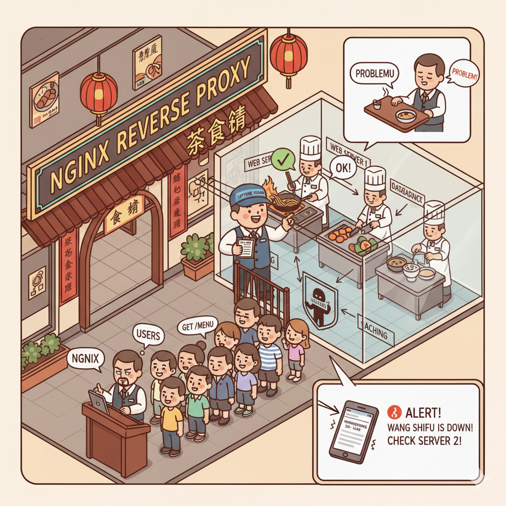

overview

# uptime-kuma

Uptime-kuma 就好似你專門請嚟嘅「餐廳巡邏員」。

呢位巡邏員的工作唔係招呼客，亦唔係幫手炒菜。佢唯一的工作就係不停地巡邏：

定期「巡視」（Monitoring）：佢會每隔一陣（例如每 5 分鐘）就去廚房嗰度「睄」下每個廚師係咪仲喺度做緊嘢。佢會問：「喂，王師傅，你仲得唔得呀？」如果王師傅應返「得！」，咁佢就記錄低「正常」。

發現問題「報警」（Alerting）：萬一王師傅有事冇答佢（即係 Server down 咗），呢位巡邏員就會立刻攞個大聲公（例如發個 Telegram 或者電郵）通知老細：「老細！老細！王師傅瓜咗啦！快啲去睇睇！」

簡單嚟講，Uptime-kuma 喺度就係做緊個「睇場」角色。對外，佢唔會接觸客，但對內，佢默默咁幫你監察成間餐廳（網站）行得行得順，一有風吹草動就即刻話你知，令到你可以喺客發現之前已經搞掂個問題，保持間餐廳（網站）嘅「上線率」。

## 資料來源

以下是參考的資料來源:

1. <https://openwrt.org/docs/guide-user/base-system/basic-networking>
1. <https://wiki.openwrt.org/doc/uci/network>
1. <https://wiki.openwrt.org/doc/techref/swconfig>
1. <https://openwrt-nctu.gitbook.io/project>
