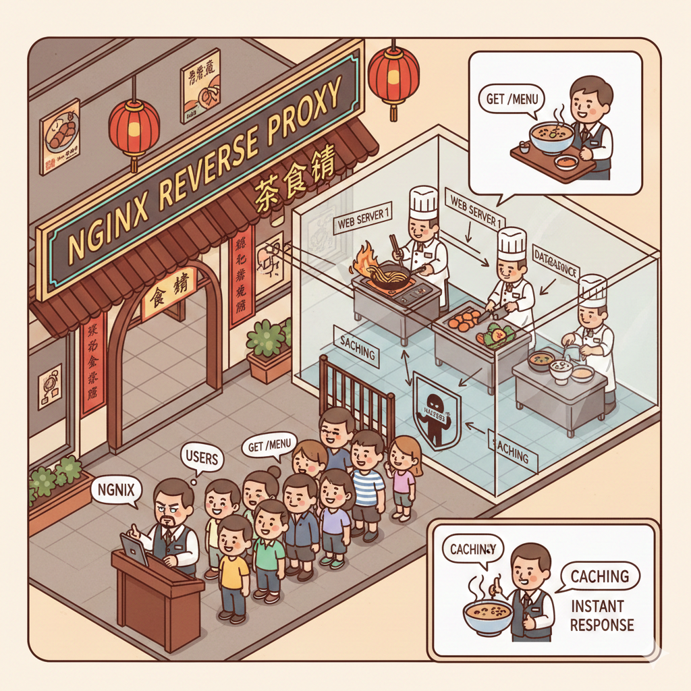

overview

## 介紹番 nginx-reverse-proxy / 反向代理

咩係 Reverse Proxy？（以 Nginx 為例）

想像一下你開咗間好火紅嘅茶餐廳。
以前細舖嗰陣，客入到嚟直接搵老細（Server）落單就得。
但而家生意太大，你請咗個超勁嘅部長企喺門口，呢位部長就係 Nginx Reverse Proxy。

當客（User）想入嚟食嘢，佢哋唔會直接衝入廚房搵廚師，而係先通過部長。部長會幫你處理幾樣嘢：

- **維持秩序（Load Balancing）**：如果入面有幾個廚師，部長會睇下邊個得閒，就將張單傳畀邊個，唔會等死一個。
- **保護私隱（Security）**：客永遠唔知廚房入面有幾多人、喺邊度炒緊菜，部長擋喺前面，黑粉（Hacker）就難啲直接攻擊到你個核心 Server。
- **送餐快啲（Caching）**：如果個個都問「今日例湯係咩？」，部長直接答你就得，唔使次次入廚房問。

簡單嚟講，Nginx 喺度就係做緊個「中間人」角色。

- **對外**，佢代表成間餐廳；
- **對內**，佢默默咁幫你分配工作、擋咁啲麻煩嘢，令到成個網站行得更順、更安全。

## 資料來源

以下是參考的資料來源:

1. <https://nginxproxymanager.com/guide>

<!--
prompt

Hi, i want to write a paragraph to introduct `what is reverse proxy`.
plesae use `nginx reverse proxy` as an example.
write a introduction in about 200 words to let the laymen know what is reverse proxy.

thanks.

-->